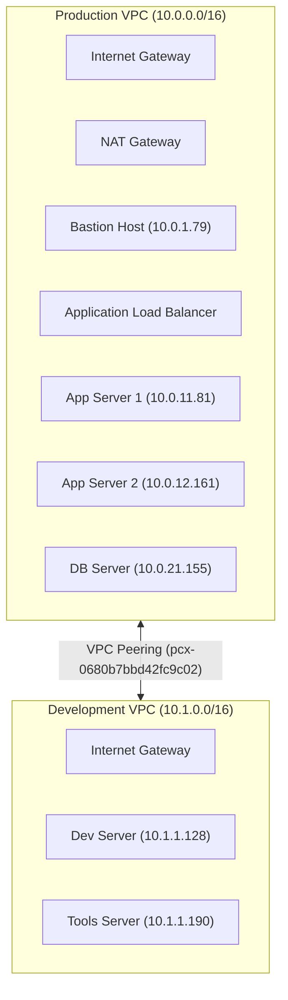

# 🌐 Mini Enterprise AWS Infrastructure

A secure, multi-VPC AWS network infrastructure featuring Production and Development environments connected via VPC Peering, along with a deployment pipeline and automated monitoring stack.

---

## 🏛️ Infrastructure Architecture



---

## 📋 Simple Explanation of Components

### 1. Network Environments
* **Production VPC (`10.0.0.0/16`)**:
  * **Public Subnet**: Hosts the **Bastion Host** (SSH gateway) and the **Application Load Balancer (ALB)** which routes external HTTP traffic.
  * **Private App Subnet**: Houses **App Server 1 & 2** running Nginx. They have no public IP and are secure from direct internet access.
  * **Private DB Subnet**: Hosts the **Database Server**, isolated from both the internet and public subnets.
* **Development VPC (`10.1.0.0/16`)**:
  * **Public Subnet**: Hosts the **Dev Server** and **Tools Server** (running Jenkins, Grafana, and Prometheus).

### 2. VPC Peering Connection
Allows secure, direct private IP-to-IP routing between instances in the Production and Development VPCs without traversing the public internet.

### 3. CI/CD Deployment Flow
```
Developer pushes code -> GitHub Actions -> SSH via Bastion -> Deploys to App Server 1 & 2
```

---

## 🔧 VPC Peering Troubleshooting Case

During audit, we identified that Development instances could not communicate with Production. The root cause and fix were:

* **Issue**: The Dev VPC Route Table was incorrectly routing to `0.0.0.0/16` via the peering connection (a typo).
* **Fix**:
  1. Updated Dev VPC route table to use the correct Production range (`10.0.0.0/16`).
  2. Added return routes in the Prod Public route table for `10.1.0.0/16`.
  3. Authorized ICMP traffic in Security Groups to allow ping testing.
