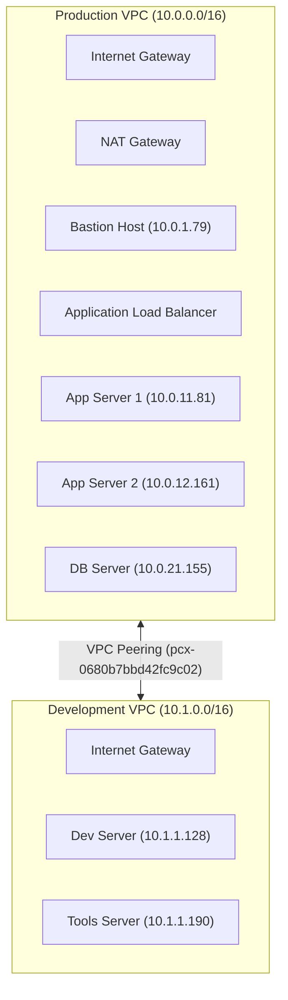

# 🏛️ Architecture Specification

This specification maps the complete topology and IP routing scheme of the Mini Enterprise AWS Lab.

## 1. Network Topology

## 2. Resource Directory

### Production Environment (`10.0.0.0/16`)
| Resource | Private IP | Public IP / DNS | Subnet | Role |
| :--- | :--- | :--- | :--- | :--- |
| **Bastion Host** | `10.0.1.79` | `13.201.0.208` | `10.0.1.0/24` (Public) | Secure SSH Gateway |
| **ALB** | — | `prod-alb-67643845.ap-south-1.elb.amazonaws.com` | `10.0.1.0/24`, `10.0.2.0/24` | HTTP Public Entrypoint |
| **App Server 1** | `10.0.11.81` | — | `10.0.11.0/24` (Private) | Nginx Web Server |
| **App Server 2** | `10.0.12.161` | — | `10.0.12.0/24` (Private) | Nginx Web Server |
| **DB Server** | `10.0.21.155` | — | `10.0.21.0/24` (Private) | Database Backend |

### Development Environment (`10.1.0.0/16`)
| Resource | Private IP | Public IP | Subnet | Role |
| :--- | :--- | :--- | :--- | :--- |
| **Dev Server** | `10.1.1.128` | `13.234.48.120` | `10.1.1.0/24` (Public) | Standalone Dev Node |
| **Tools Server** | `10.1.1.190` | `13.234.33.226` | `10.1.1.0/24` (Public) | Jenkins/Grafana/Prometheus Host |
