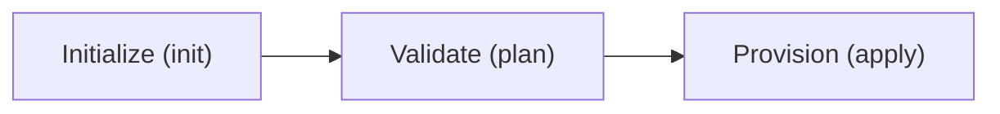

# 🗺️ Terraform Deployment Roadmap

How to deploy the modular AWS infrastructure codebase using Terraform.

## 1. Setup Instructions



### Step 1: Credentials Setup
Configure AWS CLI session credentials:
```bash
aws configure
```

### Step 2: Initialize Terraform Workspace
Install AWS provider plugins and download required modules:
```bash
cd terraform
terraform init
```

### Step 3: Execution Plan Check
Generate and review execution changes before provisioning:
```bash
terraform plan
```

### Step 4: Provision Infrastructure
Create resources in your AWS account:
```bash
terraform apply -auto-approve
```

## 2. Outputs Validation
Once the resources are successfully created:
1. Verify web app access using the generated `prod-alb` DNS name.
2. Verify Tools Server services (Jenkins: `8080`, Grafana: `3000`, Prometheus: `9090`).
